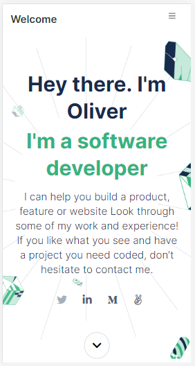

# Project Portfolio

> This is my showcase of my recently works

Setup and mobile version of my portfolio.

## Built With

- HtML file
- CSS file
- linter

## Live Demo

[Live Demo Link](https://oliverscz.github.io/mobile-version-project/)

## Getting Started

In order for the project to be viewed correctly, you have to enable the mobile view in the browser of your choice. I suggest you use google chrome. 

### Prerequisites

Google Chrome browser

### Setup
Open index.html file with google chrome and right clic in any part of the page and go to Inspect option and enable display mobile.

### Deployment
For better results you can put the resolution in Iphone6/7/8

## Authors

👤 **Author**

- GitHub: [@olivercoimbra](https://github.com/olivercoimbra)
- Twitter: [@olivercoimbra](https://twitter.com/olivercoimbra)
- LinkedIn: [olivercoimbra](https://linkedin.com/in/olivercoimbra)

## 🤝 Contributing

Contributions, issues, and feature requests are welcome!

Feel free to check the [issues page](../../issues/).

## Show your support

Give a ⭐️ if you like this project!

## Acknowledgments

- Hat tip to anyone whose code was used
- Inspiration
- etc

## 📝 License

This project is [MIT](./MIT.md) licensed.
